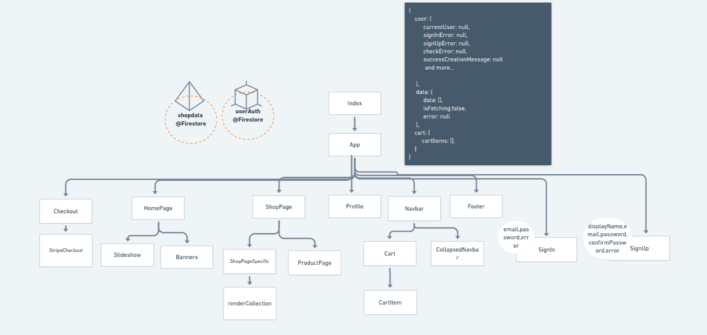
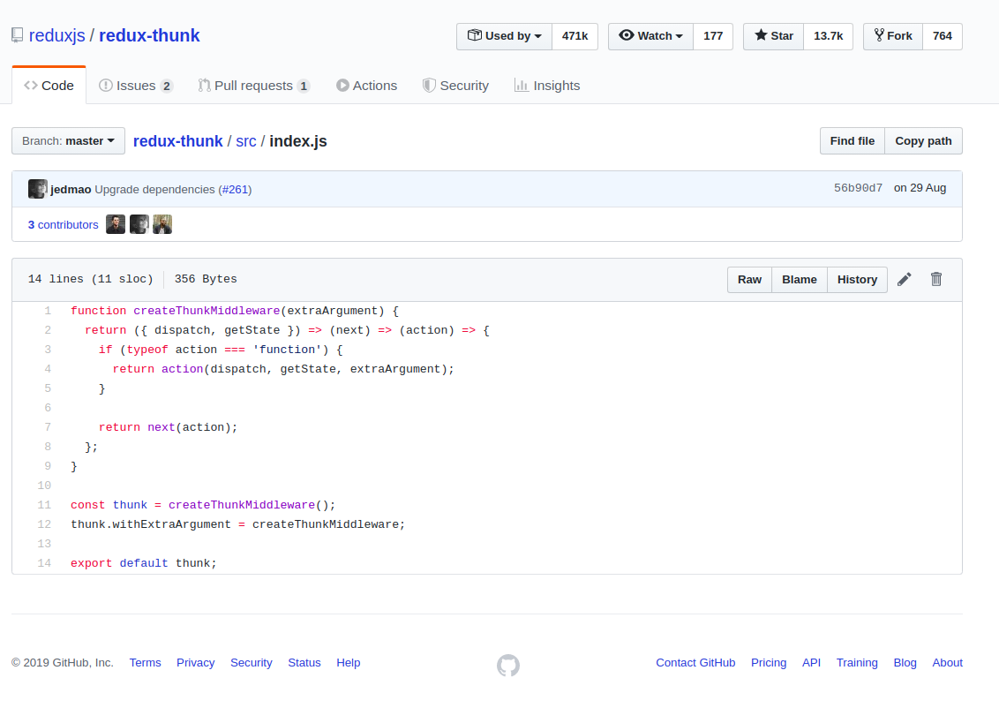

## Closet Goodies


An E-Commerce Website build in React

## Peek a boo!


## Component Tree



## Firebase

- Auth => GoogleOAuth, EmailandPasswordAuth
- Firestore - for users and data storage

## Important

- adding some demodata to firebase firestore:
  - use batch() to add multiple data at a time to firestore, so that we don't save partial data to firebase if some network error occurs and we end up some data in firestore and some don't.
  - Creates a write batch, used for performing multiple writes as a single atomic operation. The maximum number of writes allowed in a single WriteBatch is 500
  - used inside `addShopDataToFirestore()`

## State Management - Redux

---

#### why am i using it?

- Because I didn't like props drilling to pass data as for debugging I need to go all the way up to see from where it was coming
- other Reasons:

  - Forgetting to pass props
  - Problem in manageing deeply nested state
  - Duplicate information in state
  - Not updating all dependent props
  - Components with large number of props
  - uncertanity where a piece if data is managed

- #### 3 Principles of redux

  - Single Source of truth(store)
  - State is read only
  - changes are made using pure functions

- #### Action -> Reducer -> Store -> Components

  - **action**

    - an action is a piece of data that contains the information required to make a state update.
    - a object with type:'some reducer action' and payload:'some update' passed to store.dispatch() to update certain property of store state. i.e. actions must be dispatched to make a state update.
    - functions that create the actions are action creators.

  - **Reducer**

    - A **pure function** which takes the previous state and an update and returns a _new object(immutability)_ with updation applied to passed state.

  - **store**: (Internally implemented as a class)
    - Responsible for maintaining state
    - Exposes getter via `store.getState()`
    - can only be updated through reducers by calling `store.dispatch({type:"", payload:""})`
    - can add listeners that get invoked when state changes(Reconcilliation)
    - a place where all the dynamic data or the state is stored.

### Middlewares

- [redux-thunk](https://github.com/reduxjs/redux-thunk) and logger

- Async redux dispatching is done using middleware redux thunk, which is I guess is a smart way to alter the actions which are to take argument of type functions to take a dispatch as an argument and dispatching **START, SUCCESS, FAILURE** actions depending upon the asynchronous activites and time of it.
  

### Color Pallets

[Thank you visme.co](https://visme.co/blog/website-color-schemes)

```
#939393
#717171
#242323
#f56618
purple
```

### Stretch

- [x] Persist the cart in localstorage
- [ ] store review system
- [ ] day sell like monday sell , tuesday sell ... in left corner at fixed like sale.png
- [ ] Add items listgroup at the men,women, girls,boys pages.
- [ ] Change Avatar in the profile page
- [ ] Add stripe charges as well at the backend then deploy backend as well

### Attribution/Credits

- loading.io
- flaticons.com
  - Icons made by <a href="https://www.flaticon.com/authors/flat-icons" title="Flat Icons">Flat Icons</a> from <a href="https://www.flaticon.com/" title="Flaticon"> www.flaticon.com</a>
- unsplash.com
